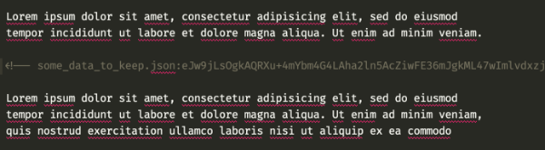
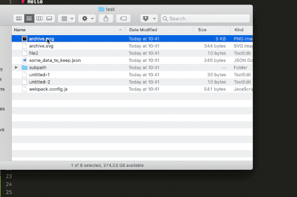

# Markdown Code Packer

Packs code and files into markdown documents.
This Sublime 3 plugin converts code blocks to compressed, single-line comments to improve visibility.

## Motivation

For my personal note taking and note sharing, I often want to **save all project code in my [Markdown](https://daringfireball.net/projects/markdown/) documents**.
But too many **code blocks disrupt the reading flow** and there is **no way to extract all files**.
This plugin allows to pack and unpack code blocks/files in a document.

Examples:

- show off a [technical spike](https://en.wikipedia.org/wiki/Spike_(software_development)), but also keep the needed but boring config files
- include a lengthy CSV table you want to send along for reference
- archive a set of files as a starter template for a project
- include a small asset in your note, so you don't have to keep it as an additional file

Up until now, I solved these use cases by creating a [gist](https://gist.github.com/), put files in an `assets/` folder or zip the whole document along with its files.
This plugin removes the need for these.

before:


after:



## Features

`Markdown Code Packer: Pack`: Pack selected code block(s)
`Markdown Code Packer: Unpack`: Unpack selected code block(s)
`Markdown Code Packer: Extract Selection to Folder`: Extract selected blocks to a folder (filename can include relative path)
`Markdown Code Packer: Extract All to Folder`: Extract all blocks in the document to a folder
`Markdown Code Packer: Pack Folder`: Insert all files of a folder into the document

You can also include binary files (e.g. images)

**Pack/Unpack**


**Extract All to Folder**


**Pack Folder**



**Demo Documents**

- [Test](demos/Test.md): Use for playing around - also includes an a binary file (image) to extract
- [My Mac Setup](demos/MyMacSetup.md): Includes packed config files.
- [Webpack](demos/Webpack.md): Includes mini-projects, make sure to select one and then extract it to a folder

## Installation

- With Package Control: Open the command palette and run the `Package Control: Install Package` command, find and install the `Markdown Code Packer` plugin.
- Manually: Clone or download git repository into your packages folder (to find the folder run the command `Preferences - Browse Packages`).

_If you are wondering what `[[202003271748]]` means: These are references to other notes (see [Sublime ZK](https://github.com/renerocksai/sublime_zk) for more info)._

## Format

Unpacked format:

    `optional_filename`:

    ```optional_type
    // code
    ```

Packed format:

     <!-- filename:packed -->

For packing I chose deflate and then base64 (see [assets/FormatChoice.md] for more info).

## Contribute

Please create an issue if you find a bug or fix it and make a pull request.
For direct contact, please find my email on [tomrothe.de](http://tomrothe.de).

<!-- to generate a new sublime package (for submission to `packagecontrol.io`) use the command `Package Control: Create Package File`. -->

## TODO

- Add versioning: If you are using GitHub or BitBucket for your hosting, you will need to create a tag each time you want to make a new version available to users. The tag names must be a semantic version number. 
- Publish
  - Package Control: https://packagecontrol.io/docs/submitting_a_package#Step_6
  - HackerNews
- VSCode plugin?
- Command line tool (with brew formula)?
- remember/infer file type for fenced code blocks
